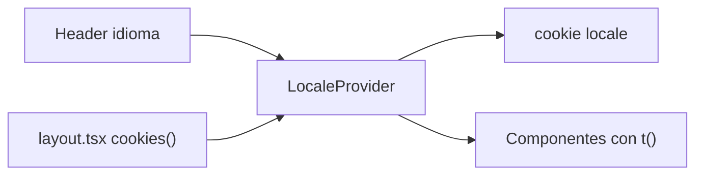

# Cambio de idioma ES/EN desde el header

El botón `idioma` en [components/Header.tsx](components/Header.tsx) hoy no abre menú ni cambia nada. Todo el copy está hardcodeado en español (home, servicios, nosotros, contacto, WhatsApp).

## Enfoque

Mismas rutas (`/`, `/servicios`, `/nosotros`). Un `LocaleProvider` con contexto React (`es` | `en`) y diccionarios de copy.

- Al elegir idioma: se actualiza el contexto (cambio instantáneo) y se guarda cookie `locale`.
- El layout server lee esa cookie con `cookies()` y pasa `initialLocale` al provider + `lang` en `<html>`. Así no hay flash de español si la visita anterior fue en inglés.
- Sin librerías nuevas (`next-intl` no hace falta con este modelo).

## Archivos nuevos

- [lib/i18n/messages.ts](lib/i18n/messages.ts): un objeto `es` / `en` por sección (`nav`, `hero`, `capabilities`, `servicesHome`, `reviews`, `brands`, `contact`, `about`, `serviciosPage`, `whatsapp`, `meta`). Incluye textos de UI, formularios, tooltips y testimonios.
- [lib/i18n/locale-context.tsx](lib/i18n/locale-context.tsx): `LocaleProvider`, hook `useLocale()` que expone `{ locale, setLocale, t }` (el copy del idioma activo).
- [components/LanguageSwitcher.tsx](components/LanguageSwitcher.tsx): dropdown (desktop y móvil) con **Español** / **English**. Cierra al elegir o al click afuera.
- [components/WhatsAppButton.tsx](components/WhatsAppButton.tsx): el link flotante de [app/layout.tsx](app/layout.tsx), para que el mensaje prellenado también se traduzca.

## Cambios en UI

- [components/Header.tsx](components/Header.tsx): reemplazar los dos botones `idioma` por `LanguageSwitcher`. Labels de nav y `aria-label` del menú salen del diccionario. Las rutas no cambian.
- [app/layout.tsx](app/layout.tsx): `lang={locale}`, metadata según cookie, wrap con `LocaleProvider`, WhatsApp extraído.
- Componentes y páginas con copy: [Hero.tsx](components/Hero.tsx), [Capabilities.tsx](components/Capabilities.tsx), [Services.tsx](components/Services.tsx), [Reviews.tsx](components/Reviews.tsx), [Brands.tsx](components/Brands.tsx), [Contact.tsx](components/Contact.tsx), [app/nosotros/page.tsx](app/nosotros/page.tsx), [app/servicios/page.tsx](app/servicios/page.tsx).

Los que hoy son server components y necesitan `t()` (`Hero`, `Capabilities`, `Brands`) pasan a `"use client"`. En `nosotros` y `servicios` se mantienen la estructura/JSX (negritas, tooltip de posición arancelaria, slider); solo el copy viene del diccionario.

## Copy en inglés

Traducción completa de UI y contenidos de marketing (hero, capacidades, servicios, nosotros, contacto, WhatsApp). En testimonios se traducen título, “aspectos destacados”, tiempos (“+5 años juntos”) y las citas.

## Verificación

En el browser: abrir el dropdown en desktop y en el menú móvil, pasar a English, confirmar home / servicios / nosotros / footer / WhatsApp, recargar y comprobar que sigue en inglés, volver a Español.